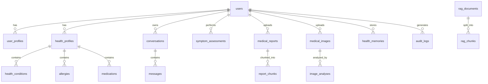

# Database Specification: AI Healthcare Assistant

## 1. Overview
The database engine is built for full relational integrity, ACID transactions, strict multi-tenant isolation, and zero-leakage security.
- **Development & Local Execution:** SQLite 3 with Write-Ahead Logging (`WAL` mode), foreign keys explicitly enforced (`PRAGMA foreign_keys = ON`), and in-process connection pooling.
- **Production Compatibility:** Standard ANSI SQL DDL compatible with PostgreSQL 15+.

---

## 2. Entity-Relationship Diagram

---

## 3. Schema & Table Definitions

### 3.1 Users (`users`)
- `id` (VARCHAR(36), PRIMARY KEY, UUID v4)
- `email` (VARCHAR(255), UNIQUE, NOT NULL, indexed)
- `password_hash` (VARCHAR(255), NOT NULL)
- `role` (VARCHAR(32), DEFAULT 'patient', NOT NULL) — 'patient', 'doctor', 'admin'
- `is_verified` (BOOLEAN, DEFAULT FALSE)
- `created_at` (TIMESTAMP, NOT NULL)
- `updated_at` (TIMESTAMP, NOT NULL)

### 3.2 User Profiles (`user_profiles`)
- `id` (VARCHAR(36), PRIMARY KEY)
- `user_id` (VARCHAR(36), UNIQUE, FOREIGN KEY -> users.id ON DELETE CASCADE)
- `full_name` (VARCHAR(128), NOT NULL)
- `date_of_birth` (DATE)
- `gender` (VARCHAR(32))
- `phone` (VARCHAR(32))
- `preferred_language` (VARCHAR(8), DEFAULT 'en') — 'en', 'hi', 'mr'
- `emergency_contact_name` (VARCHAR(128))
- `emergency_contact_phone` (VARCHAR(32))
- `emergency_contact_relation` (VARCHAR(64))
- `created_at` (TIMESTAMP, NOT NULL)
- `updated_at` (TIMESTAMP, NOT NULL)

### 3.3 Health Profiles (`health_profiles`)
- `id` (VARCHAR(36), PRIMARY KEY)
- `user_id` (VARCHAR(36), UNIQUE, FOREIGN KEY -> users.id ON DELETE CASCADE)
- `blood_type` (VARCHAR(8))
- `height_cm` (DECIMAL(5,2))
- `weight_kg` (DECIMAL(5,2))
- `smoking_status` (VARCHAR(32))
- `alcohol_status` (VARCHAR(32))
- `dietary_preferences` (TEXT)
- `created_at` (TIMESTAMP, NOT NULL)
- `updated_at` (TIMESTAMP, NOT NULL)

### 3.4 Allergies (`allergies`)
- `id` (VARCHAR(36), PRIMARY KEY)
- `health_profile_id` (VARCHAR(36), FOREIGN KEY -> health_profiles.id ON DELETE CASCADE)
- `allergen` (VARCHAR(128), NOT NULL)
- `reaction` (VARCHAR(255))
- `severity` (VARCHAR(32)) — 'mild', 'moderate', 'severe', 'anaphylactic'
- `diagnosed_year` (INTEGER)

### 3.5 Conditions (`health_conditions`)
- `id` (VARCHAR(36), PRIMARY KEY)
- `health_profile_id` (VARCHAR(36), FOREIGN KEY -> health_profiles.id ON DELETE CASCADE)
- `condition_name` (VARCHAR(128), NOT NULL)
- `status` (VARCHAR(32)) — 'active', 'managed', 'resolved'
- `diagnosed_date` (DATE)
- `notes` (TEXT)

### 3.6 Medications (`medications`)
- `id` (VARCHAR(36), PRIMARY KEY)
- `health_profile_id` (VARCHAR(36), FOREIGN KEY -> health_profiles.id ON DELETE CASCADE)
- `medicine_name` (VARCHAR(128), NOT NULL)
- `dosage` (VARCHAR(64))
- `frequency` (VARCHAR(64))
- `start_date` (DATE)
- `is_current` (BOOLEAN, DEFAULT TRUE)

### 3.7 Conversations & Messages (`conversations`, `messages`)
- `conversations.id` (VARCHAR(36), PRIMARY KEY)
- `conversations.user_id` (VARCHAR(36), FOREIGN KEY -> users.id ON DELETE CASCADE)
- `conversations.title` (VARCHAR(255), NOT NULL)
- `conversations.created_at`, `updated_at`
- `messages.id` (VARCHAR(36), PRIMARY KEY)
- `messages.conversation_id` (VARCHAR(36), FOREIGN KEY -> conversations.id ON DELETE CASCADE)
- `messages.sender` (VARCHAR(16), NOT NULL) — 'user', 'assistant', 'system'
- `messages.content` (TEXT, NOT NULL)
- `messages.citations_json` (TEXT) — JSON array of RAG citation references
- `messages.created_at` (TIMESTAMP, NOT NULL)

### 3.8 Symptom Assessments (`symptom_assessments`)
- `id` (VARCHAR(36), PRIMARY KEY)
- `user_id` (VARCHAR(36), FOREIGN KEY -> users.id ON DELETE CASCADE)
- `reported_symptoms` (TEXT, NOT NULL)
- `duration` (VARCHAR(64))
- `severity_scale` (INTEGER) — 1 to 10
- `urgency_level` (VARCHAR(32), NOT NULL) — 'self_care', 'routine', 'prompt', 'urgent', 'emergency'
- `is_emergency_override` (BOOLEAN, DEFAULT FALSE)
- `assessment_result_json` (TEXT, NOT NULL)
- `created_at` (TIMESTAMP, NOT NULL)

### 3.9 Medical Reports & Chunks (`medical_reports`, `report_chunks`)
- `medical_reports.id` (VARCHAR(36), PRIMARY KEY)
- `medical_reports.user_id` (VARCHAR(36), FOREIGN KEY -> users.id ON DELETE CASCADE)
- `medical_reports.filename` (VARCHAR(255), NOT NULL)
- `medical_reports.storage_path` (VARCHAR(512), NOT NULL)
- `medical_reports.file_type` (VARCHAR(64), NOT NULL)
- `medical_reports.file_size_bytes` (INTEGER, NOT NULL)
- `medical_reports.status` (VARCHAR(32), DEFAULT 'processing') — 'processing', 'analyzed', 'failed'
- `medical_reports.extracted_text` (TEXT)
- `medical_reports.summary_json` (TEXT)
- `report_chunks.id` (VARCHAR(36), PRIMARY KEY)
- `report_chunks.report_id` (VARCHAR(36), FOREIGN KEY -> medical_reports.id ON DELETE CASCADE)
- `report_chunks.user_id` (VARCHAR(36), NOT NULL, indexed for isolation)
- `report_chunks.chunk_index` (INTEGER, NOT NULL)
- `report_chunks.chunk_text` (TEXT, NOT NULL)
- `report_chunks.embedding_json` (TEXT)

### 3.10 Medical Images & Analyses (`medical_images`, `image_analyses`)
- `medical_images.id` (VARCHAR(36), PRIMARY KEY)
- `medical_images.user_id` (VARCHAR(36), FOREIGN KEY -> users.id ON DELETE CASCADE)
- `medical_images.filename` (VARCHAR(255), NOT NULL)
- `medical_images.storage_path` (VARCHAR(512), NOT NULL)
- `medical_images.modality` (VARCHAR(32)) — 'xray', 'mri', 'ct', 'dermatology', 'other'
- `medical_images.body_part` (VARCHAR(64))
- `image_analyses.id` (VARCHAR(36), PRIMARY KEY)
- `image_analyses.image_id` (VARCHAR(36), FOREIGN KEY -> medical_images.id ON DELETE CASCADE)
- `image_analyses.findings_json` (TEXT, NOT NULL)
- `image_analyses.confidence_score` (DECIMAL(3,2))
- `image_analyses.urgency` (VARCHAR(32))
- `image_analyses.disclaimer_acknowledged` (BOOLEAN, DEFAULT FALSE)

### 3.11 Health Memories (`health_memories`)
- `id` (VARCHAR(36), PRIMARY KEY)
- `user_id` (VARCHAR(36), FOREIGN KEY -> users.id ON DELETE CASCADE)
- `category` (VARCHAR(32), NOT NULL) — 'symptom_history', 'medication_reaction', 'preference', 'clinical_note'
- `memory_text` (TEXT, NOT NULL)
- `source_reference` (VARCHAR(128))
- `is_active` (BOOLEAN, DEFAULT TRUE)
- `created_at` (TIMESTAMP, NOT NULL)

### 3.12 Global RAG Knowledge Base (`rag_documents`, `rag_chunks`)
- `rag_documents.id` (VARCHAR(36), PRIMARY KEY)
- `rag_documents.title` (VARCHAR(255), NOT NULL)
- `rag_documents.source_organization` (VARCHAR(128), NOT NULL)
- `rag_documents.source_url` (VARCHAR(512))
- `rag_documents.publication_date` (VARCHAR(32))
- `rag_documents.evidence_level` (VARCHAR(32)) — 'A' (systematic review), 'B' (guideline/clinical trial), 'C' (consensus)
- `rag_chunks.id` (VARCHAR(36), PRIMARY KEY)
- `rag_chunks.document_id` (VARCHAR(36), FOREIGN KEY -> rag_documents.id ON DELETE CASCADE)
- `rag_chunks.chunk_text` (TEXT, NOT NULL)
- `rag_chunks.embedding_json` (TEXT)
- `rag_chunks.keywords` (TEXT)

### 3.13 Audit & Safety Logs (`audit_logs`)
- `id` (VARCHAR(36), PRIMARY KEY)
- `user_id` (VARCHAR(36))
- `action` (VARCHAR(64), NOT NULL)
- `resource_type` (VARCHAR(64), NOT NULL)
- `resource_id` (VARCHAR(36))
- `ip_address` (VARCHAR(45))
- `user_agent` (VARCHAR(255))
- `details_json` (TEXT)
- `created_at` (TIMESTAMP, NOT NULL)
